  

<picture>
  <source media="(prefers-color-scheme: dark)" srcset="./.github/assets/snake-dark.svg">
  <source media="(prefers-color-scheme: light)" srcset="./.github/assets/snake.svg">
  
</picture>
